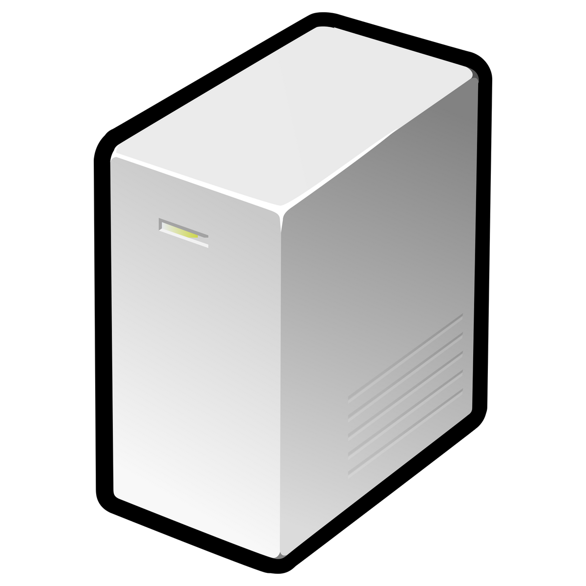
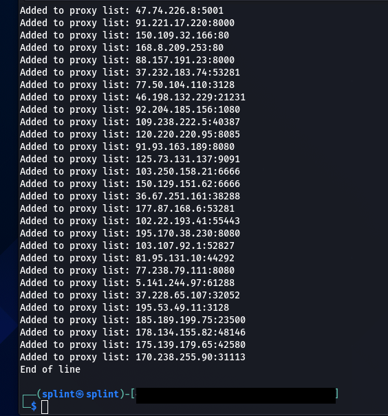

# Auto Proxy
Installs a list of proxies from the web.

# What is Auto Proxy?

Autoproxy exclusively uses Brave Browser, together with the Chromedriver to utilize Selenium and access your web browser without opening it at all. It installs the list of IPs and ports listed on the website, which it meshes together in order to create you a proxy list. This is an automated task that takes less time than copying the list yourself.

# Windows Instructions

1. Install Selenium: pip install selenium
2. Install Brave: https://brave.com
3. Install Chromedriver: https://chromedriver.chromium.org/downloads
4. Run the .py file
5. Success

# Linux Instructions

1. Install Selenium: pip install selenium
2. Install Brave: https://brave.com
3. Install Chromedriver: https://chromedriver.chromium.org/downloads
4. Brave should be in /opt/brave.com/brave/brave
5. Chromedriver should be in /usr/bin/chromedriver
6. Do not run as root
7. Run the .py file
8. Success
